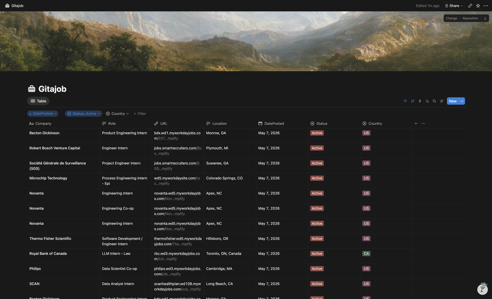

# gitajob

Tracks technical internship postings from curated GitHub repos and syncs them to a Notion database on a schedule.



## What it does

- Pulls internship listings from:
  - [speedyapply/2027-SWE-College-Jobs](https://github.com/speedyapply/2027-SWE-College-Jobs)
  - [negarprh/Canadian-Tech-Internships-2027](https://github.com/negarprh/Canadian-Tech-Internships-2027)
  - [SimplifyJobs/Summer2027-Internships](https://github.com/SimplifyJobs/Summer2027-Internships)
  - [hanzili/canada_sde_intern_position](https://github.com/hanzili/canada_sde_intern_position)
- Keeps only roles that look technical (SWE, dev, devops, cloud, infra, security, data, AI/ML, etc.)
- Keeps only US/Canada jobs (with location normalization and country inference)
- Uses a fixed date cutoff (`2026-05-01`) to ignore stale postings
  - For sources without explicit posting dates, falls back to the latest commit date of the source file
- Writes jobs to Notion and marks missing active jobs as `Removed`
- Stores source SHAs in `last_run.json` to skip unchanged repos

## Repo layout

```text
src/
  main.ts                 # orchestrator
  github.ts               # GitHub fetch helpers (SHA + raw file content)
  notion.ts               # Notion read/create/remove operations
  constants.ts            # global constants (cutoff date)
  types.ts
  parsers/
    index.ts              # parser registry + source config
    swe-college-jobs.ts
    canadian-internships.ts
    simplify.ts
    canada-sde-intern-position.ts
  utils/
    location.ts           # US/CA location + country detection
    role.ts               # technical-role classification
    hash.ts               # stable job id
```

## Notion database schema

Create a Notion database with these property names:

- `Company` (Title)
- `Role` (Text)
- `Location` (Text)
- `Country` (Select)
- `URL` (URL)
- `Source` (Text)
- `ID` (Text)
- `Status` (Select)
- `DatePosted` (Date)
- `DaysOpen` (Formula: `dateBetween(now(), prop("DatePosted"), "days")`)

`Status` should include at least: `Active`, `Removed`, `Applied`, `Interviewing`, `Rejected`, `Offer`.

## Environment variables

Create a local `.env` file:

```bash
NOTION_TOKEN=...
NOTION_DB_ID=...
# optional second target database (public-facing clone)
NOTION_PUBLIC_DB_ID=...
# optional write delay between Notion mutations (default: 120)
NOTION_WRITE_DELAY_MS=120
```

Notes:
- `NOTION_DB_ID` should be the database ID only (no `?v=...` suffix)
- `GITHUB_TOKEN` is optional locally, but recommended in CI

## Run locally

Install:

```bash
npm install
```

Dry run (no writes to Notion, no `last_run.json` update):

```bash
DRY_RUN=1 npx ts-node src/main.ts
```

Real sync:

```bash
npx ts-node src/main.ts
```

## GitHub Actions

Workflow: `.github/workflows/scrape.yml`

- Runs every 6 hours (`0 */6 * * *`)
- Can be triggered manually (`workflow_dispatch`)
- Commits updated `last_run.json` when SHA state changes

Set these **repository secrets**:

- `NOTION_TOKEN`
- `NOTION_DB_ID`

`GITHUB_TOKEN` is built-in and does not need to be created manually.

## Design notes

- Full-file parsing is used per changed SHA (not patch-line diff parsing). This is deliberate: grouped rows (`↳`) and table structure are easier to parse correctly with full context.
- Dedup uses a stable hash of `company + role + url`.
- Removal is status-based (`Removed`) rather than deleting pages, so history stays in Notion.